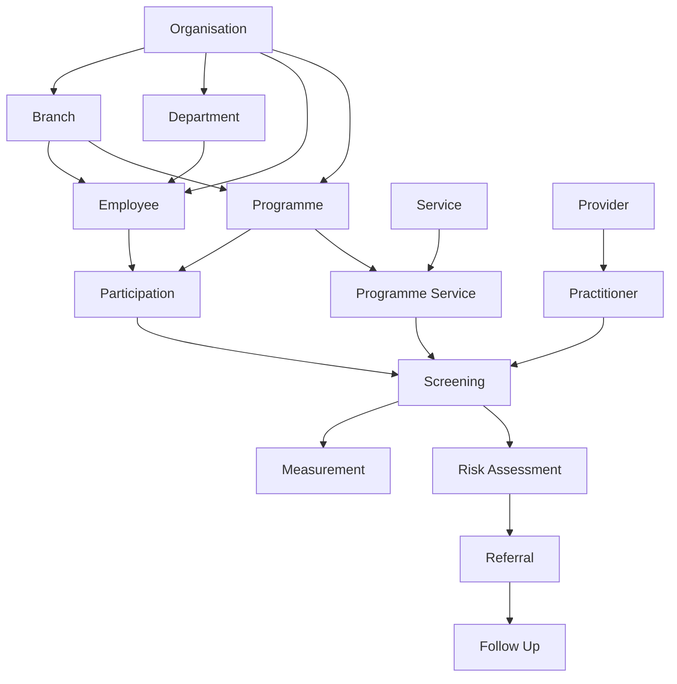

# Pulse80 Data Relationship Map

## Purpose

This document explains how the current Pulse80 analytics datasets connect to each other. It is based on the EDA work on the `analytics` branch.

The main question the data model should help Pulse80 answer is:

> Which organisation ran which wellness programme, for which employees, which services were delivered, who delivered them, what was measured, what risks were found, and what happened after a referral?

## Main data flow



## 1. Organisation

An organisation is the client company using Pulse80.

`organisation_id` is the main identifier.

An organisation can have many branches, departments, employees and programmes.

**Links**

- Organisation → Branch using `organisation_id`
- Organisation → Department using `organisation_id`
- Organisation → Employee using `organisation_id`
- Organisation → Programme using `organisation_id`

## 2. Branch

A branch is a physical location belonging to an organisation.

For example, an organisation may have a head office and an operations site.

`branch_id` identifies the branch and `organisation_id` tells us which organisation owns it.

Employees and programmes can both point to a branch.

## 3. Department

A department is a business area inside an organisation, such as Finance, Engineering or Human Resources.

`department_id` identifies the department and `organisation_id` connects it directly to the organisation.

Employees use `department_id` to show which department they belong to.

A department does not need to belong to a branch in the current analytics data.

## 4. Employee

An employee is a person in the organisation who may take part in a Pulse80 programme.

The analytics data uses `employee_id` and `employee_reference` rather than employee names.

An employee links to:

- an organisation through `organisation_id`
- a branch through `branch_id`
- a department through `department_id`

The employee then connects to a programme through Participation.

## 5. Programme

A programme is wellness work Pulse80 runs for an organisation.

Examples can include a screening programme or another wellness programme.

A programme belongs to an organisation and can be delivered at a branch.

`programme_id` is used by Participation and Programme Services.

## 6. Service

A service describes a wellness service Pulse80 can deliver.

Examples include blood pressure, BMI, glucose, cholesterol, stress or fitness services.

`service_id` identifies the service.

Services are not attached directly to programmes. The connection is made through Programme Services.

## 7. Programme Service

Programme Services is the bridge between Programmes and Services.

It answers:

> Which services were included in this programme?

For example, one programme can include blood pressure, BMI and glucose services.

The relationship is:

`Programme → Programme Service → Service`

A programme can have many services and a service can be used by many programmes.

`programme_service_id` is also important because Screenings use it to identify exactly which programme service was delivered.

## 8. Participation

Participation records that an employee took part in a programme.

It connects:

`Employee → Participation ← Programme`

This allows Pulse80 to calculate programme participation and attendance without putting employee details directly into programme records.

`participation_id` is later used by Screening.

## 9. Provider

A provider is the organisation or business that practitioners belong to.

Examples in the current structure can include a clinic or fitness company.

`provider_id` connects Providers to Practitioners.

The relationship is:

`Provider → Practitioner`

## 10. Practitioner

A practitioner is the person who delivers a screening or service.

Practitioner data includes professional type, registration information and verification status.

Each practitioner belongs to a provider using `provider_id`.

Screenings use `practitioner_id`, which allows Pulse80 to know who delivered each screening.

The relationship is:

`Provider → Practitioner → Screening`

## 11. Screening

Screening is the central delivery event in the analytics model.

Each screening connects three important things:

1. `participation_id` — who participated and in which programme
2. `programme_service_id` — which service from that programme was delivered
3. `practitioner_id` — which practitioner delivered it

This creates the chain:

`Employee → Participation → Screening ← Programme Service ← Service`

and:

`Provider → Practitioner → Screening`

This is what connects the client side of Pulse80 to the practitioner/service-delivery side.

## 12. Measurement

Measurements contain the actual values captured during screenings.

Examples include weight, height, BMI, systolic blood pressure and diastolic blood pressure.

Measurements use a long format. One screening can therefore have several measurement rows.

The relationship is:

`Screening → Measurements`

using `screening_id`.

The current EDA treats `(screening_id, metric_code)` as the natural unique measurement combination.

## 13. Risk Assessment

A Risk Assessment stores the risk result calculated from a screening.

It includes fields such as:

- `risk_level`
- `risk_code`
- `requires_referral`
- `assessment_source`
- `rules_version`

The current data has one Risk Assessment per `screening_id`.

The relationship is:

`Screening → Risk Assessment`

## 14. Referral

A referral is created when a risk needs further action.

`risk_assessment_id` connects the referral back to the risk that caused it.

The relationship is:

`Risk Assessment → Referral`

Not every Risk Assessment needs a referral. The current EDA therefore treats referral coverage as something Pulse80 must monitor.

## 15. Follow Up

A Follow Up records what happened after a referral.

It connects to Referral using `referral_id`.

The relationship is:

`Referral → Follow Up`

This completes the current analytics journey from programme delivery to health action.

## Full business journey

In simple terms, the data moves through Pulse80 like this:

```text
Organisation
   ↓
Branch / Department / Employees
   ↓
Programme
   ↓
Participation + Programme Services
   ↓
Screening
   ↓
Measurements
   ↓
Risk Assessment
   ↓
Referral
   ↓
Follow Up
```

At the same time, the delivery side connects through:

```text
Provider
   ↓
Practitioner
   ↓
Screening
```

## Why this relationship map matters

This model allows Pulse80 to move from separate CSV files to connected information.

It can support questions such as:

- How many employees participated in a programme?
- Which services were delivered?
- Which branch or department had the highest participation?
- How many screenings were completed?
- What measurements were captured?
- What risks were identified?
- How many risks required referrals?
- Were the required referrals created?
- Were referrals followed up?
- Which practitioners and providers delivered the services?

## Important analytics rule

Client reporting should use aggregated information. Employee-level records are useful for joining and calculating analytics, but Pulse80 client dashboards should not expose individual employee health information when an aggregate view can answer the business question.

## Technical source

The detailed table and key definitions are stored in:

`data-analytics/docs/pulse80-data-relationship-map.dbml`

The DBML file is the technical ERD source. This Markdown file is the simple-English explanation of the same model.
